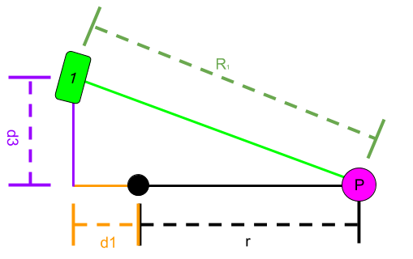
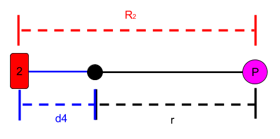
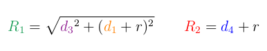
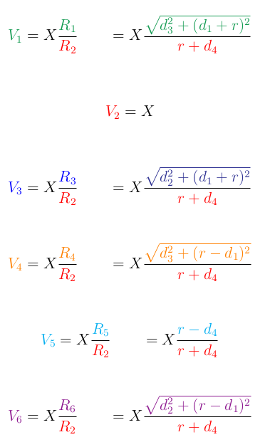
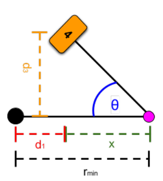
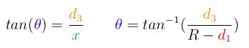

# 6-wheel vehicle model beetlebot_AIOZ with Rocker-bogie mechanism

The model was created from Solidworks and transfer to gazebo to define the ROS/gazebo/control section

## Structure folder:
- `/beetlebot_control` : 
  *  Include file .yaml for define `joint` for controller
  *  Include file control using keyboard `keyboard_controller.py` and  transfer to file `control_6_wheel_4_sterring.py` for processing and signal control six-wheel follow to the method [AckerMan](#ackerman-steering)

- `/beetlebot_description` : 
  *  Include `meshes file` identify hardware components of robot.
  *  Include file `xacro` & `gazebo`  for establishing robot on Gazebo

- `/beetlebot_gazebo` : 
  *  Include folder  file run system: `launch` & `worlds`

```
/beetlebot_control
  ├── /config
  |    └── beetlebot_control.yaml
  ├── /launch
  |    └── beetlebot_control.launch
  ├── /scripts
  |    └── control_6_wheel_4_sterring.py
  |    └── robot.py
  |    └── keyboard_controller.py
  ├── CMakeLists.txt
  └── package.xml

/beetlebot_description 
  ├── /meshes
  ├── /urdf
  ├── CMakeLists.txt
  └── package.xml

/beetlebot_gazebo 
  ├── /launch
  ├── /worlds
  ├── CMakeLists.txt
  └── package.xml

```

## [Algorithm](https://github.com/nasa-jpl/open-source-rover/blob/master/Software/Software%20Controls.pdf)
### Ackerman steering


### Control system







* Velocity of each wheel:



* Turning degree of each wheel:





* Rotate 360 degree


